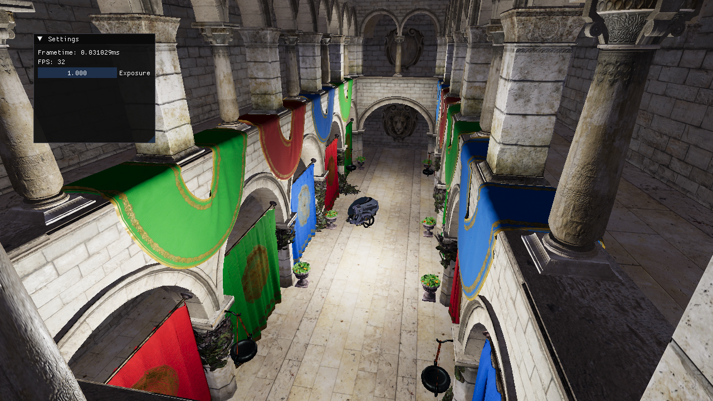

# A simple OpenGL renderer
I develop this in my spare time.\

## Feature list:
- Physically based rendering
- Model loading
- Normal and emmision maps
- HDR rendering with tone mapping (Reinhard)
- Multiple lights

## Compilation

### GNU/Linux
( The platform the renderer is being developed on )

    git clone --recursive https://github.com/Jan-Stangelj/Renderer.git
    cd Renderer
    mkdir build
    cmake -S . -B build
    cd build
    make -j

### Windows
You should be able to clone this project and use cmake GUI to compile it
for your platform of choice (eg. Visual Studio), but I do not guarantee support.

### MacOS
The renderer will likely use modern OpenGL features like compute shaders, that are not supported in OpenGL 4.1. Currently it probally works, but I don't test it, as I dont own Apple devices.

## Assets and 3rd party liraries
- [PolyHaven](https://polyhaven.com/)
- [glTF-Sample-Assets](https://github.com/KhronosGroup/glTF-Sample-Assets)
- [Glad](https://glad.dav1d.de/)
- [GLFW](https://www.glfw.org/)
- [glm](https://github.com/g-truc/glm)
- [stb](https://github.com/nothings/stb)
- [assimp](https://github.com/assimp/assimp)